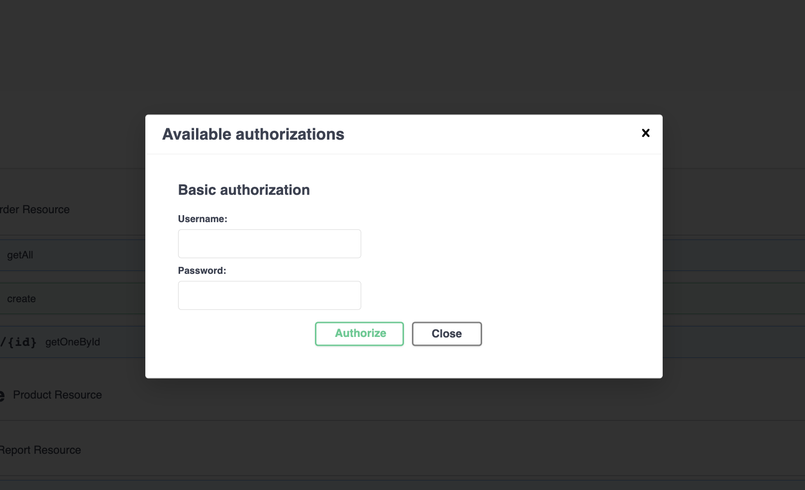

# Retailer Application

Exercising application implementing Products CRUD operations and its orders

## Application Architecture

This application built using N-Ties. The application depends on Three main layers:

- The Presentation tier which contains the REST Endpoints (Resource Directory)
- The Logic Tier which has all business validation (Service Directory)
- The Data Tier which responsible for dealing with the Database (Repository Directory)

## UML and Entities

- Product Entity
    - Name : String
    - Description : String
    - Price : Big Decimal
    - Available Quantity : Integer (The available amount of the product in the stock)

- Order Entity
    - Customer Name : String
    - Customer Email : String
    - Customer Email : String
    - time : ZonedDateTime (The Order time)
    - Total Price : Big Decimal (The total amount of the order)

- Order Product Entity
    - Quantity : Integer (the requested quantity of specific product)
    - Quantity Price : Big Decimal (the price of the product * the requested quantity)

### UML Notes:

- Each Order has at least one Order Product
- The Order Product has the information about the product, the quantity of the product, and the price of (product * the
  requested quantity)
- The Order Product represented as a bridge table linking the order to the product, containing more information as
  mentioned above.

## Used Technologies and Frameworks:

- Spring Boot
- Spring Specifications for searching for Products by different criteria
- Swagger UI
- Mysql Database
- H2 Database on local environment
- Liquibase for building the tables on the startup and adding seed data
- Junit for Unit Test
- Integration Test and Parameterized test cases (covers more than 83% of the application, and I'm interested to make it
  100%)
- Spring Security (Basic Auth)
- Integration with Twilio by sending SMS to the customer on creating an order
- Docker
- Kubernetes

## How to run the application locally

All you need is:

1- packaging the application (just for the first time, No need to do it again if you are restarting the appication)

`./mvnw package`

2- run docker-compose command

`docker-compose up -d`

then open the Swagger documentation page

`localhost:8080/`

You can track the application logs by removing the detached flag (-d) to the command

`docker-compose up`

To stop the container all you need it running

`docker-compose down`

## Application Users

Out of simplicity, The application uses Basic Auth to secure the endpoint.
The application has 2 users

- The `AMDIN` user
    - Username: `admin`, Password: `admin`
    - `Admin` user owns two roles `ROLE_AMDIN` and `ROLE_USER`
    - The `Admin` user can access all endpoints
- The `USER` user
    - Username: `user`, Password: `password`
    - This user owns only one Role `ROLE_USER`
    - This user Can access the below endpoints:
        - GET `/api/products/` to get all products
        - GET `/api/products/{id}` to get specific product by id
        - POST `/api/orders` to create an order

## How to call the endpoints by Swagger
1 - Click on the Authorize button 

2 - Add the credentials in the popup 

3 - Click on Authorize

4 - Call the endpoints

You can also Log out and login with different user

# Notes
- It could take some time on running the application for the first time, as Docker will download some needed resources
  image
- The application use docker volume, so don't care about losing your data on stopping the containers
- If you need to clear up your database and start it fresh as beginning with the seed data, Just
  use `docker-compose down -v`
- To run the Test cases, just use `./mvnw verify`
- The Application uses Spring Specifications, So you can Search for Products using the combination of:
  id (equals, notEquals)
  name (equals, notEquals, or contains)
  description (equals, notEquals, or contains)
  price (equals, notEquals, greaterThanOrEquals, or lessThanOrEquals)

HINT : The combination works among these fields not among the criteria on the same field, So don't use the same field
twice with different criteria (like using name.contains and name.equals at the same time).

Example for a valid Search Criteria -> name.contains=Iphone&price.greaterThanOrEquals=999.5

Example for an invalid Search Criteria -> name.contains=Iphone&name.notEquals=macbook